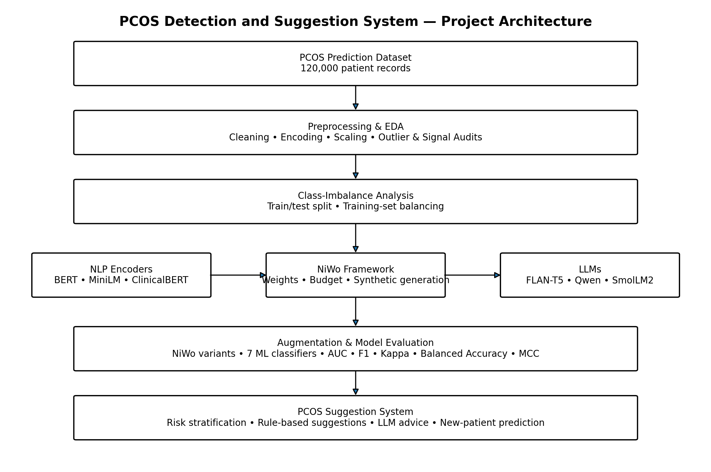
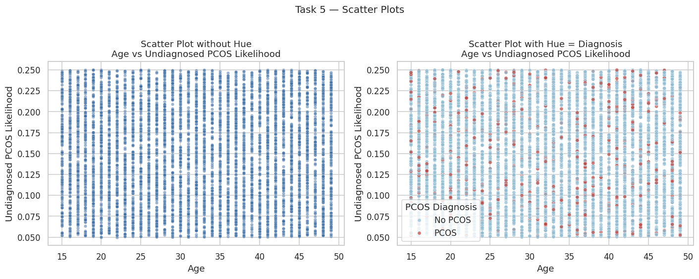
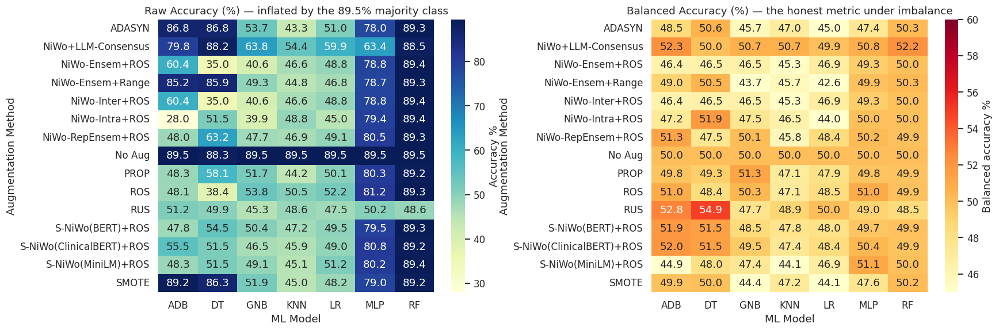
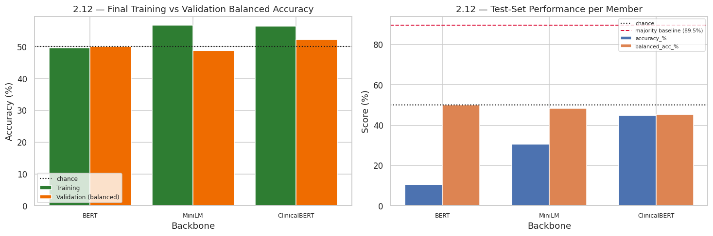
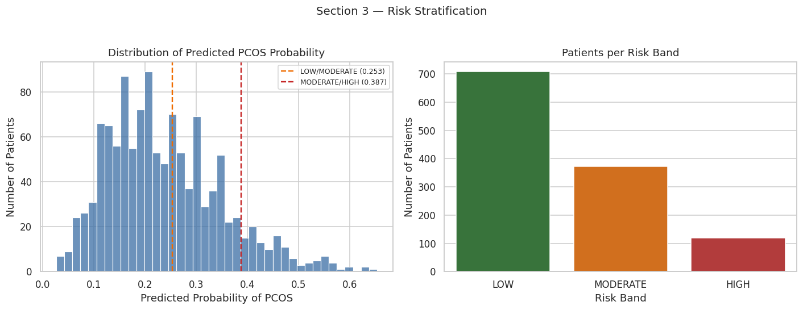

# PCOS Detection and Suggestion System

### An Interpretable Augmentation Approach Based on NiWo

**CSE445 Course Project — North South University**

This repository contains the CSE445 project **PCOS Detection and Suggestion System**, implemented as a Google Colab/Jupyter notebook. The project investigates PCOS classification on an imbalanced tabular dataset and implements the NiWo-based augmentation pipeline described in the project notebook.

> **Academic disclaimer:** This is an academic machine-learning project, not a medical device or clinical diagnostic system. PCOS diagnosis requires appropriate clinical evaluation by a qualified healthcare professional.

## Project Overview

The notebook is organized into three major sections:

1. **Data Preprocessing**
   - Dataset loading and schema configuration
   - Duplicate and missing-value analysis
   - Exploratory visualization
   - Outlier analysis
   - Feature scaling
   - Label and one-hot encoding
   - Signal/independence audit
   - Class-imbalance analysis and training-set balancing

2. **NiWo Pipeline**
   - Three NLP encoders and three LLMs
   - NiWo-Intra, NiWo-Inter and NiWo-Ensem weighting
   - Budget allocation and synthetic generation
   - Interpretability auditing
   - Multiple augmentation methods and classifiers
   - Additional novelty experiments N6–N16
   - Transformer classifiers in N17

3. **PCOS Suggestions**
   - Risk stratification
   - Rule-based clinical suggestion engine
   - LLM-generated natural-language advice
   - New-patient prediction
   - Manual-input screening demonstration


## Architecture



## Selected Results

The repository includes selected figures generated by the notebook:

### Exploratory Analysis



### Model Performance



### Transformer Diagnosis



### PCOS Risk Stratification



### Reported Deployment-Model Snapshot

The notebook's model-selection section reports **NiWo+LLM-Consensus + RF** as the deployment model for Section 3. On the 1,200-patient held-out set, the notebook reports:

- Accuracy: **88.50%**
- Balanced accuracy: **52.24%**
- AUC: **0.5584**
- PCOS recall: **0.06**
- PCOS F1: **0.10**

These values should be interpreted in the context of the severe class imbalance and the project's academic screening objective; they should **not** be interpreted as clinical diagnostic performance.


## Project Pipeline

```text
PCOS Dataset
     |
     v
Data Preprocessing
     |
     v
Class-Imbalance Analysis
     |
     v
Semantic Patient Representation
     |
     +--> BERT
     +--> MiniLM
     +--> ClinicalBERT
     |
     v
NiWo Weighting & Budget Allocation
     |
     v
Data Augmentation
     |
     +--> NiWo-Intra
     +--> NiWo-Inter
     +--> NiWo-Ensem
     +--> Other augmentation methods
     |
     v
Machine-Learning / Transformer Classifiers
     |
     v
Evaluation
     |
     +--> AUC
     +--> F1
     +--> Cohen's Kappa
     +--> Balanced Accuracy
     +--> MCC
     |
     v
PCOS Risk Stratification
     |
     v
Suggestion System
```

## Dataset

The notebook is configured for the **PCOS Prediction Dataset (120,000 patients)**.

The dataset is **not included in this repository by default**. Please obtain it from its original source and verify its redistribution/license conditions before uploading it to GitHub.

Expected filename:

```text
pcos_prediction_dataset.csv
```

For Google Colab, upload the file through the Colab Files panel.

For local/Jupyter execution, place it in the same directory as the notebook or update the dataset path in the notebook.

See [`data/README.md`](data/README.md).

## Installation

The main dependencies used by the notebook are listed in [`requirements.txt`](requirements.txt).

```bash
pip install -r requirements.txt
```

The notebook can also install its dependencies when executed in Google Colab.

## Running the Notebook

### Google Colab

1. Open `PCOS_Detection_and_Suggestion_System.ipynb`.
2. Open the notebook in Google Colab.
3. Upload `pcos_prediction_dataset.csv` using the Files panel.
4. Run the cells from top to bottom.
5. Allow the Hugging Face models to download when required.
6. Review the preprocessing, augmentation, evaluation and suggestion-system results.

### Local Jupyter

```bash
pip install -r requirements.txt
jupyter notebook
```

Then open:

```text
PCOS_Detection_and_Suggestion_System.ipynb
```

## Pretrained Models

The notebook references pretrained models including:

- `bert-base-uncased`
- `sentence-transformers/all-MiniLM-L6-v2`
- `emilyalsentzer/Bio_ClinicalBERT`
- `google/flan-t5-base`
- `Qwen/Qwen2.5-0.5B-Instruct`
- `HuggingFaceTB/SmolLM2-360M-Instruct`

The model weights are **not stored in this GitHub repository**. They are downloaded when the notebook is executed and the corresponding Hugging Face components are enabled.

## Evaluation

The notebook emphasizes evaluation beyond raw accuracy because the dataset is imbalanced. Reported metrics include:

- AUC
- F1
- Cohen's Kappa
- Balanced Accuracy
- Matthews Correlation Coefficient (MCC)
- Raw accuracy and majority-class baseline where applicable

The notebook itself contains the detailed numerical results and experiment outputs.

## Repository Structure

```text
PCOS-Detection-and-Suggestion-System/
|
├── README.md
├── PCOS_Detection_and_Suggestion_System.ipynb
├── requirements.txt
├── .gitignore
|
├── data/
│   └── README.md
|
├── results/
│   ├── README.md
│   └── figures/
|
├── src/
│   └── README.md
|
└── docs/
    └── README.md
```

## Academic Context

| Item | Details |
|---|---|
| Course | CSE445 |
| Project | PCOS Detection and Suggestion System |
| Main area | Machine Learning / NLP / Data Augmentation |
| Platform | Google Colab |
| Language | Python |
| Dataset | PCOS Prediction Dataset |
| Core framework | NiWo |

## Group Members

- Md. Shefatullah Bin Sadik
- Khatune Jannat
- Tasmia Islam

## Disclaimer

This project is intended for academic and research purposes only. Predictions and suggestions produced by the system should not be interpreted as medical diagnosis, treatment, or professional medical advice.
